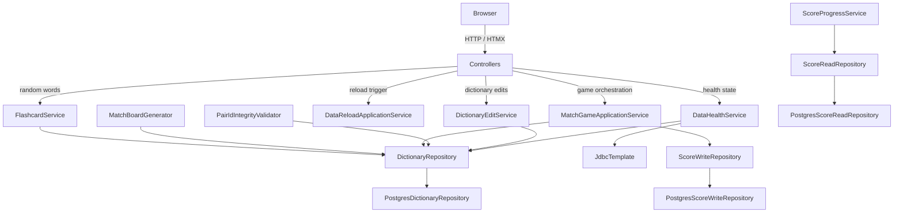

# Developer Guide

This guide reflects the current PostgreSQL-only runtime for Easy Language Learning.

## Architecture overview

Easy Language Learning is a monolithic Spring Boot MVC application with PostgreSQL as the only persistence backend.

- Active profile model: `db` is the default runtime profile.
- Test profile model: `spring.profiles.group.test=db` activates database-backed behavior for integration tests.
- Flyway manages schema migrations from `src/main/resources/db/migration`.

### Component diagram

## Repository contracts

`DictionaryRepository` now has six methods:

1. `findLanguage(String languageCode)`
2. `availableLanguages()`
3. `updateGlobalEnabled(String pairId, boolean enabled)`
4. `updateWordContent(String pairId, String fromWord, String toWord, String example)`
5. `insertWord(String languageCode, String pairId, String fromWord, String toWord, String example, boolean globalEnabled)`
6. `upsertModeEligibility(String pairId, String mode, boolean enabled)`

`PostgresDictionaryRepository` implements all six methods and reads mode data from `mode_eligibility`.

## Data health and snapshots

`DataHealthService` uses `DictionaryRepository` plus `JdbcTemplate` score health checks.

Reload behavior is resilient: all exceptions are caught and the service enters degraded state when DB access fails.

`DataSnapshot` now has only five fields: `wordsHealthy`, `scoresHealthy`, `wordErrors`, `scoreErrors`, `multiLanguageData`.

Removed fields: `wordData`, `scoreData`.

## Dictionary editing and service usage

`DictionaryEditService` writes through `DictionaryRepository` (PostgreSQL), with no file-path checks or CSV writes.

`FlashcardService`, `MatchBoardGenerator`, `MatchGameApplicationService`, and `PairIdIntegrityValidator` now use `DictionaryRepository` directly.

## Configuration and profiles

Main runtime config is in `src/main/resources/application.properties`.

- `spring.profiles.active=db`
- `spring.profiles.group.test=db`

`DictionaryProperties` includes only:

1. `primaryLanguageCode`
2. `modes`

`rootPath` was removed.

## Migrations and tests

- `V1__init.sql` is baseline schema.
- `V2__mode_eligibility.sql` adds `mode_eligibility` with FK to `dictionary_pair`.

Controller integration tests extend `AbstractControllerIntegrationTest` and run against PostgreSQL Testcontainers.
