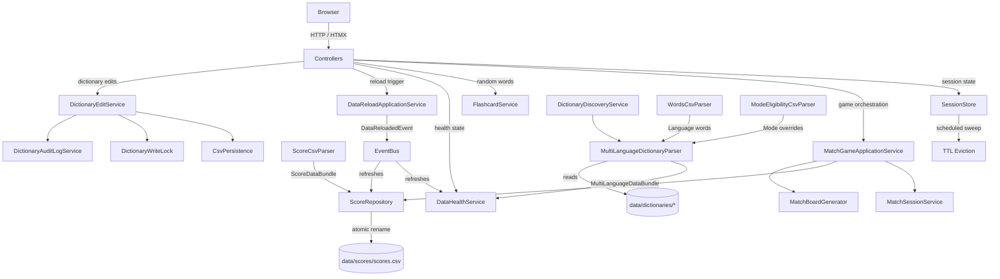
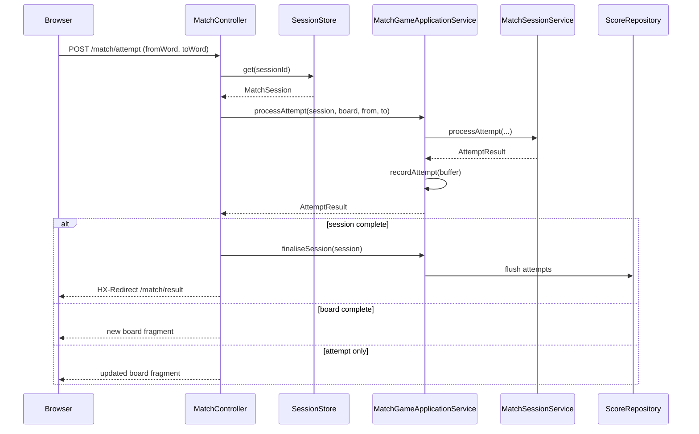

# Developer Guide

This guide covers the project architecture, codebase structure, configuration, testing strategy, and how to extend the application.

## Table of Contents

- [Architecture overview](#architecture-overview)
- [Account and session management](#account-and-session-management)
- [Project structure](#project-structure)
- [Mobile support](#mobile-support)
- [Build and run](#build-and-run)
- [Configuration reference](#configuration-reference)
- [Security model](#security-model)
- [Data model](#data-model)
- [Scoring model updates (phase 1)](#scoring-model-updates-phase-1)
- [Testing](#testing)
- [Extending the app](#extending-the-app)
- [Known constraints and backlog](#known-constraints-and-backlog)

---

## Architecture overview

Easy Language Learning is a monolithic Spring Boot MVC application. It is intentionally local-first: word data and score history are read from CSV files on startup and held in memory during runtime. There is no external database.

### Component diagram



### Request flow — match attempt



### Layer responsibilities

| Layer | Package | Responsibility |
| --- | --- | --- |
| Controllers | `controller` | HTTP request handling, session attribute management, view selection |
| Application services | `service` | Use-case orchestration; no HTTP or persistence knowledge |
| Domain | `domain` | Game state, rules, result types; pure Java, no Spring dependencies |
| Repository | `repository` | CSV read/write; isolated persistence concern |
| Validation | `validation` | CSV parsing with full error collection; returns `CsvParseResult<T>` |
| Config | `config` | `@ConfigurationProperties` beans and Spring Security filter chain |

### Key design decisions

**Event-driven data reload.** `DataReloadApplicationService` fires a `DataReloadedEvent` via the Spring `ApplicationEventPublisher`. All data-holding services (`DataHealthService`, `FlashcardService`, `ScoreRepository`) listen independently and refresh themselves. This keeps reload logic decoupled from data consumers.

**Stateless controllers.** Mutable game state lives in `HttpSession` (board reference) and `SessionStore` (match session object). Controllers hold no mutable fields.

**Replay prevention.** `MatchBoard` tracks which pairs have already been matched. Re-submitting a previously matched pair is classified as a failure rather than a success. This prevents artificially inflating the success counter by replaying a correct pair.

**Atomic score writes.** `ScoreRepository` writes to a temp file beside the target path, then renames it over the live file. This avoids partial writes if the JVM crashes mid-write.

**NullAway enforcement.** The Gradle build runs Error Prone + NullAway in strict JSpecify mode over all `com.yodawife.*` packages. Unannotated nullable flows are compile-time errors.

---

## Account and session management

Phase 1 introduces account selection and signed-in/guest context backed by `HttpSession` and CSV persistence.

### Architecture

- `Account` (record): immutable account model with `userId` (stable UUID string), `displayName`, and `createdAt`.
- `ActiveUserContext` (record): session snapshot of current user (`userId`, `displayName`, `signedIn`).
- `SessionAttributes.ACTIVE_USER`: shared session key constant with value `"activeUser"`.
- `AccountRepository`: persistence contract (`findById`, `findByDisplayName`, `findAll`, `save`).
- `CsvAccountRepository`: CSV adapter using `app.accounts.file-path` (default `./data/users/users.csv`), in-memory cache, and atomic temp-file rename writes.
- `AccountService`: orchestrates find/create account, sign-in, sign-out, and active-user resolution.

### HTTP endpoints

All account endpoints are public and return HTMX fragments.

- `GET /account/panel` — account modal content (known users + active user)
- `POST /account/sign-in` — sign in with existing/new display name
- `POST /account/sign-out` — clear active user context
- `GET /account/status` — signed-in/guest status fragment

### Session behavior

- Active user state is stored in `HttpSession` under key `"activeUser"`.
- Page reloads keep the same active user while the session remains valid.
- Signing out removes only the active user attribute; it does not invalidate the whole session.

---

## Project structure

```
src/main/java/com/yodawife/easyll/
├── config/
│   ├── DictionaryProperties.java     app.dictionaries.*
│   ├── MatchGameProperties.java      app.match.*
│   └── SecurityConfig.java
├── controller/
│   ├── AccountController.java        /account/panel, /account/sign-in, /account/sign-out, /account/status
│   ├── DictionaryController.java     /dictionary, /dictionary/rows, toggle endpoints
│   ├── FlashcardsController.java
│   ├── HealthController.java
│   ├── HomeController.java
│   └── MatchController.java
├── domain/
│   ├── Account.java
│   ├── ActiveUserContext.java
│   ├── LanguageBundle.java
│   ├── MultiLanguageDataBundle.java
│   ├── ModeEligibility.java
│   ├── ScoreKey.java
│   ├── SessionAttributes.java
│   ├── Word.java
│   ├── WordId.java
│   └── ...
├── repository/
│   ├── AccountRepository.java
│   ├── CsvAccountRepository.java
│   └── ScoreRepository.java
├── service/
│   ├── AccountService.java
│   ├── DataHealthService.java
│   ├── DictionaryEditService.java
│   ├── DictionaryDiscoveryService.java
│   ├── DictionaryWriteLock.java
│   ├── CsvPersistence.java
│   ├── EligibilityEvaluator.java
│   ├── FlashcardService.java
│   ├── MatchBoardGenerator.java
│   ├── ScoreMigrationService.java
│   ├── ScoreProgressService.java
│   └── ...
└── validation/
    ├── MultiLanguageDictionaryParser.java
    ├── WordsCsvParser.java
    ├── ModeEligibilityCsvParser.java
    └── ScoreCsvParser.java

src/main/resources/
├── application.properties
├── static/css/
└── templates/
    ├── dictionary.html
    ├── flashcards.html
    ├── index.html
    ├── match.html
    ├── fragments/
    └── health/

data/
└── dictionaries/
    ├── hun/
    │   ├── words.csv
    │   └── mode-eligibility.csv
    └── pl/
        ├── words.csv
        └── mode-eligibility.csv

src/test/java/com/yodawife/easyll/
    controller/                      @WebMvcTest + MockMvc + spring-security-test
    domain/                          Pure unit tests; no Spring context
    repository/                      ScoreRepository read/write with temp files
    service/                         Service unit tests (Mockito + pure JUnit)
    validation/                      CSV parser positive and negative cases
```

---

## Mobile support

The UI is responsive with a primary breakpoint at `576px`.

### Key mobile behaviors

- Header height reduces to `50px`; title size to `14px`.
- Mobile safe-area support is enabled using `env(safe-area-inset-*)`.
- Header navigation uses a house icon button on small screens and a text "Home" link on larger screens.
- Home mode cards stack vertically with icon-left alignment.
- Flashcards use full-width cards (up to `260px`) and larger readable word text (`26px`).
- Match keeps two columns on mobile with compact spacing, language labels, sticky progress, and a tap hint.
- Dictionary switches to a card-style layout below `576px`.

### Related templates and styles

- `templates/layout/base.html` — viewport and responsive home navigation.
- `templates/fragments/board.html` — language labels, sticky progress class, and tap hint.
- `templates/dictionary.html` — redesigned toolbar and sortable table headers.
- `templates/fragments/dictionary-row.html` — compact toggle switches and row action icon.
- `templates/fragments/dictionary-table.html` — numbered pagination with ellipsis and improved empty states.
- `static/css/app.css` — all responsive/mobile and dictionary redesign styling.

---

## Build and run

**Prerequisite:** Java 26. The Gradle toolchain configuration enforces this; the build will fail if the required JDK is absent.

```sh
# Run the application
./gradlew bootRun          # Linux / macOS
gradlew.bat bootRun        # Windows

# Run all tests
./gradlew test

# Build a runnable JAR
./gradlew bootJar
# Output: build/libs/easyll-0.0.1-SNAPSHOT.jar
```

Test reports are written to `build/reports/tests/test/index.html`.

> [!NOTE]
> The build runs NullAway in strict mode. Compilation fails on unannotated nullable flows anywhere in `com.yodawife.*`. Annotate return types or parameters with `@Nullable` from `org.jspecify.annotations` where needed.

---

## Configuration reference

All properties live in `src/main/resources/application.properties`. Override per-environment values in a profile-specific file (e.g. `application-test.properties` for tests).

| Property | Default | Description |
| --- | --- | --- |
| `app.dictionaries.root-path` | `./data/dictionaries` | Root folder containing per-language dictionary subfolders. |
| `app.dictionaries.primary-language-code` | `hun` | Fallback language code used when no explicit language is selected. |
| `app.dictionaries.modes` | `flashcards,match` | Supported mode names used by dictionary toggles and eligibility checks. |
| `app.scores.file-path` | `./data/scores/scores.csv` | Score CSV read path. |
| `app.scores.write-path` | `./data/scores/scores.csv` | Score CSV write path. Can differ from the read path for staged setups; must be a filesystem path (not classpath). |
| `app.accounts.file-path` | `./data/users/users.csv` | Accounts CSV read/write path for account selection and sign-in state. |
| `app.match.max-attempts` | `30` | Successful matches required to complete a session. Minimum 1. |
| `app.match.board-size` | `5` | Word pairs per match board. Minimum 1. |
| `app.match.session-ttl-minutes` | `60` | Idle TTL for match sessions in minutes. Sessions not accessed within this window are evicted by the scheduled sweep. Minimum 1. |
| `spring.security.user.name` | `admin` | Admin username for HTTP Basic Auth on `/admin/**`. |
| `spring.security.user.password` | `admin` | Admin password. **Change this before any non-localhost deployment.** |
| `spring.security.user.roles` | `ADMIN` | Role granted to the admin user. |

---

## Security model

Security is provided by Spring Security, configured in `SecurityConfig`.

### Access rules

| Path pattern | Access |
| --- | --- |
| `/`, `/session/start` | Public |
| `/dictionary`, `/dictionary/**` | Public |
| `/flashcards`, `/flashcards/card` | Public |
| `/match`, `/match/attempt`, `/match/result` | Public |
| `/health/data` | Public |
| `/account/panel`, `/account/sign-in`, `/account/sign-out`, `/account/status` | Public |
| `/css/**`, `/webjars/**` | Public |
| `/admin/**` | Requires `ROLE_ADMIN` (HTTP Basic) |
| Any other path | Authenticated |

### Design rationale

- **HTTP Basic, no form login.** Unauthenticated requests to `/admin/**` receive a `401` response instead of a redirect to a login page. This keeps the admin flow simple and HTMX-compatible.
- **CSRF disabled.** HTMX POST requests from the browser do not carry a CSRF token. Disabling CSRF is acceptable here because the only state-mutating protected endpoint (`POST /admin/data/reload`) is guarded by credentials, and the application does not use cookies for session authentication.
- **Single in-memory admin user.** The credential is configured via `spring.security.user.*` properties. For production use, replace this with a proper `UserDetailsService` backed by a secure store.

---

## Data model

### Multi-language dictionaries

Each language has a dedicated folder under `data/dictionaries/{languageCode}`.

#### words.csv

Semicolon-delimited UTF-8, with header row.

```text
WORD_ID;FROM;TO;EXAMPLE;GLOBAL_ENABLED
90eadc73-ef0e-3efe-a5f3-e2ecd0b76d28;Letter;Betű;Írtam egy betűt a barátomnak.;true
```

`WORD_ID` values are UUID strings. Existing seeded dictionaries use deterministic type-3 UUIDs generated from `languageCode:fromWord:toWord` via `UUID.nameUUIDFromBytes(...)`, which provides globally unique identifiers across dictionaries for stable score keys.

Validation:
- Exactly 5 columns.
- `WORD_ID`, `FROM`, and `TO` must be non-blank.
- `WORD_ID` must be unique within a language.
- `GLOBAL_ENABLED` must be `true` or `false`.

#### mode-eligibility.csv

Semicolon-delimited UTF-8, with header row.

```text
WORD_ID;MODE;ENABLED
w1;flashcards;true
w1;match;false
```

Validation:
- Exactly 3 columns.
- `WORD_ID` must exist in words.csv for that language.
- `MODE` must be non-blank.
- `ENABLED` must be `true` or `false`.
- `(WORD_ID, MODE)` must be unique.

Missing `mode-eligibility.csv` is treated as empty (all words enabled per mode by default).

`mode-eligibility.csv` references the same `WORD_ID` UUID values used in `words.csv`.

Eligibility used by games:
- `word.globalEnabled == true`
- and mode override is enabled, or missing (defaults to enabled).

### Score CSV (`data/scores/scores.csv`)

Semicolon-delimited, UTF-8. No header row.

```text
USER_ID;PAIR_ID;MODE;HISTORY
6f59df77-74c3-4f0a-8c85-a0f4a96d2740;90eadc73-ef0e-3efe-a5f3-e2ecd0b76d28;match;S,F,S,S
```

Parsed into `ScoreDataBundle` containing a `Map<ScoreKey, UserWordHistory>` where `ScoreKey = (userId, pairId, mode)`.

**Validation:**
- HISTORY must contain only `S` or `F` tokens separated by commas.
- Blank HISTORY values are invalid.
- History is capped to the **last 12 entries** per `(userId, pairId, mode)` (`UserWordHistory.MAX_HISTORY = 12`).
- A missing score file is treated as empty history (not an error).

### Migration behavior

- Legacy score rows (`nickname;fromWord;toWord;history`) are migrated automatically by `ScoreMigrationService` when `ScoreCsvParser` parses filesystem-based score data.
- New row format is `userId;pairId;mode;history`.
- Migration is one-time and atomic: original file is backed up to `.bak`, converted rows are written through a temp file and moved into place.
- Rows with unresolved `(fromWord,toWord)` mapping are skipped and logged.
- In migrated rows, `mode` is written as `match`.

---

## Scoring model updates (phase 1)

- Persistent key changed from `(nickname, fromWord, toWord)` to `(userId, pairId, mode)`.
- Signed-in users persist score history to `data/scores/scores.csv`; anonymous users still get per-session counters and result messages, but no persistent writes.
- `ScoreProgressService.getProgressForUser(userId)` returns `Map<String pairId, Integer successPercent>`.
- Dictionary progress column is enabled only for signed-in users and uses the computed success percentage.

**Write strategy.** `ScoreRepository` writes to a temp file next to the target path, then renames it atomically. This prevents partial-write corruption if the JVM is interrupted mid-write.

---

## Testing

Tests live under `src/test/java/com/yodawife/easyll/`. The test Spring profile loads `src/test/resources/application-test.properties`.

### Test categories

| Category | Package | Approach |
| --- | --- | --- |
| Domain unit tests | `domain/` | JUnit 5 + AssertJ; no Spring context loaded |
| Service unit tests | `service/` | JUnit 5 + Mockito; no Spring context loaded |
| CSV parser tests | `validation/` | JUnit 5; both positive and negative (malformed input) cases |
| Repository tests | `repository/` | JUnit 5 with temp file I/O |
| Controller tests | `controller/` | `@WebMvcTest`, MockMvc, `spring-security-test` |
| Integration tests | `controller/DataReloadIntegrationTest` | `@SpringBootTest` with full context |

### Security in controller tests

Controller tests use `spring-security-test` utilities:

- `@WithMockUser(roles = "ADMIN")` — grants admin access without real credentials.
- `.with(httpBasic("admin", "password"))` — sends HTTP Basic headers through MockMvc.
- Unauthenticated requests to `/admin/**` are asserted to return `401`.

### Running tests

```sh
./gradlew test
# HTML report: build/reports/tests/test/index.html
# XML results: build/test-results/test/
```

---

## Extending the app

### Adding a new game mode

1. **Domain** — add a session/state class in `domain/` if the mode has its own lifecycle and counters.
2. **Service** — add an application service in `service/` for use-case orchestration (attempt handling, score flush).
3. **Controller** — add a `@Controller` with GET (page render) and POST (action) mappings.
4. **Templates** — add Thymeleaf templates under `src/main/resources/templates/`.
5. **Session start** — register the new mode string in `HomeController.startSession()`.
6. **Security** — add the new public paths to the `permitAll()` list in `SecurityConfig`.
7. **Tests** — add `@WebMvcTest` for the controller and unit tests for the service.

### Replacing CSV storage with a database

The `ScoreRepository` class is the single point of persistence for scores. To swap it:

1. Extract an interface from `ScoreRepository`.
2. Create a JPA or JDBC implementation of that interface.
3. Register the new bean; remove the CSV implementation.
4. Remove `ScoreCsvParser` and the `app.scores.*` properties.

`WordCsvParser` is similarly isolated in `validation/`. The event-driven reload architecture means a database-backed implementation can simply publish a `DataReloadedEvent` (or skip the event entirely if data is always live).

---

## Known constraints and backlog

| Item | Detail |
| --- | --- |
| In-memory sessions | Sessions are stored in a `ConcurrentHashMap`. A server restart clears all active sessions. |
| Gameplay account model | Player selection is session-based (no password authentication). |
| Single admin credential | The admin user is an in-memory Spring Security user. |
| CSV scalability | The entire word file is parsed on every reload. Performance degrades with very large files. |
| Score weighting not yet active | Per-user history is tracked but not yet used to bias word selection toward frequently failed words. |
| No HTTPS enforcement | The app does not configure TLS. Use a reverse proxy (e.g. nginx) for any non-localhost deployment. |
| Health granularity | Word-file health gates gameplay; score-file health is reported but does not block play. |
